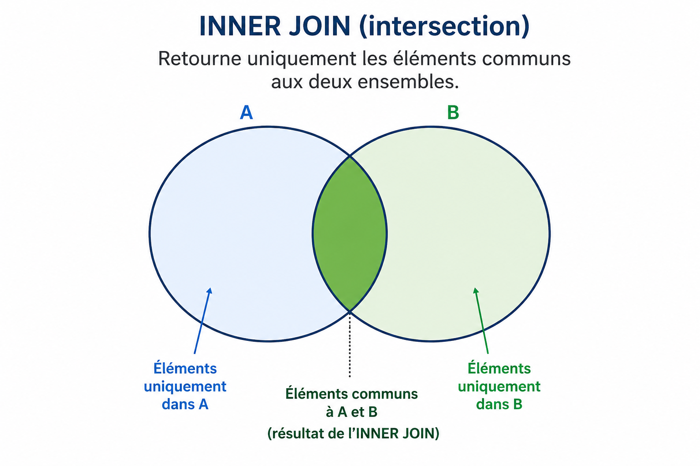
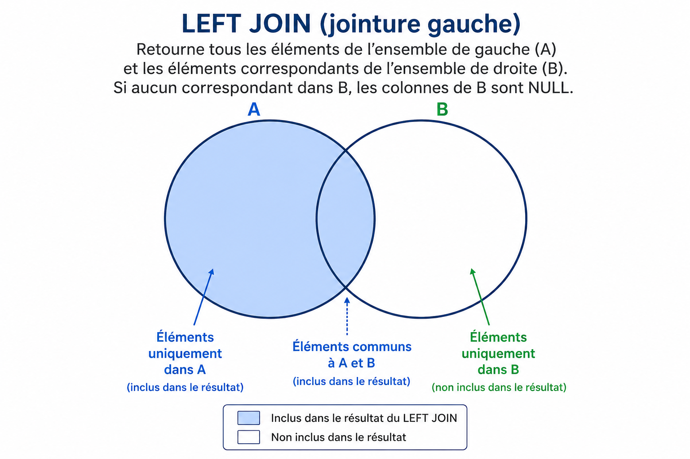
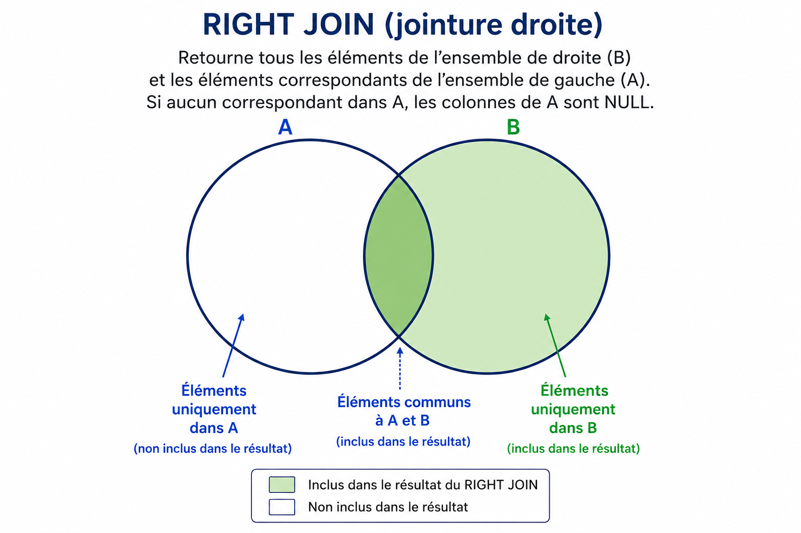

Jusqu'à présent, nous avons vu comment réaliser des requêtes (notamment `SELECT`) pour extraire des données depuis une seule table !

#def Les **jointures** permettent d'effectuer des requêtes sur plusieurs tables; et ainsi obtenir un résultat qui combinera les données issues de ces différentes tables.

# Prérequis
Pour pouvoir réaliser une jointure; il nous faut :
- Au moins 2 tables
- Que ces tables possèdent au moins chacune un champ (colonne) dont les valeurs des enregistrements (lignes) pourront être comparées avec les valeurs des enregistrements d'un champ de l'autre table.
**Rem** : il n'est pas nécessaire que les tables soient liées par une clé étrangère; mais il est important que les tables soient liées conceptuellement pour que le résultat aie du sens.
# Types de jointures
Il existe différents types de jointures.  Nous nous limiterons ici à décrire les 3 types suivants :
- `INNER JOIN`
- `LEFT JOIN`
- `RIGHT JOIN`
### Diagrammes de Venn
Pour bien se les représenter; il est toujours utile de se faire un petit schéma.
Ce petit schéma prendra la forme d'un ***diagramme de Venn***.  Ce terme ne doit pas vous faire peur... Il s'agit simplement d'une représentation graphique permettant d'illustrer les relations (intersection, union, différence) entre des ensembles représentés sous forme de cercles.

En effet, une **table étant un ensemble d'enregistrements**; dans la modélisation qui suit, chaque table sera dès lors représentée par un cercle.
### Convention de notation dans les exemples suivants :
- dans les exemples qui suivent, `A` et `B` sont des noms de tables (eg. A = Auteurs et B = Livres).
- `key` est le nom de l'attribut, pris dans chaque table et qui va servir pour la comparaison des valeurs.  Le nom de cet attribut peut (et est généralement) différent dans les deux tables. Par exemple (Il pourrait s'agir d'une clé étrangère nommée `auteur` dans la table `livres`, qui référencerait la clé primaire, nommons-là par exemple `id`, dans la table `auteurs`).
  **Attn** : ce qui est important; c'est que les valeurs contenue dans ces deux champs soient comparables (c'est à dire que l'on puisse les comparer à l'aide des opérateurs logiques : `=`, `<`,`>`,`<=`,`>=`,`!=`).  
  **Rem** : dans la plupart des cas, on cherchera une correspondance stricte; et donc l'opérateur `=` est celui qui sera le plus souvent utilisé. 

## INNER JOIN

```sql
SELECT *
FROM A
INNER JOIN B ON A.key = B.key
```

#### Fonctionnement :
- SQL va parcourir, une à une les valeurs des enregistrements de la colonne `A.key`
- Pour chaque valeur de `A.key`, il va regarder s'il trouve une correspondance dans `B.key`
- Chaque fois qu'une correspondance est trouvée; il va afficher la valeur des champs sélectionnés après le mot-clé `SELECT`.
- **Rem** : si aucune correspondance n'est trouvée dans `B.key`pour une valeur `key` d'un enregistrement de `A`; alors on passe à l'enregistrement suivant; et on on ne renvoie rien.

## LEFT JOIN


```sql
SELECT *
FROM A
LEFT JOIN B ON A.key = B.key
```

**Fonctionnement :**
- SQL va parcourir, une à une les valeurs des enregistrements de la colonne `A.key`
- Pour chaque valeur de `A.key`, il va regarder s'il trouve une correspondance dans `B.key`
- Chaque fois qu'une correspondance est trouvée; il va afficher la valeur des champs sélectionnés après le mot-clé `SELECT`.
- **Rem** : pour tous les enregistrements de `A.key` qui ne trouvent aucune correspondance dans `B.key`; on renvoie malgré tout les valeurs des attributs des ces enregistrements de A; et `NULL` pour les valeurs des attributs de `B` sélectionnés.

- ## RIGHT JOIN


```sql
SELECT *
FROM A
RIGHT JOIN B ON A.key = B.key
```

**Fonctionnement :**
- SQL va parcourir, une à une les valeurs des enregistrements de la colonne `A.key`
- Pour chaque valeur de `A.key`, il va regarder s'il trouve une correspondance dans `B.key`
- Chaque fois qu'une correspondance est trouvée; il va afficher la valeur des champs sélectionnés après le mot-clé `SELECT`.
- **Rem** : pour tous les enregistrements de `B.key` qui ne trouvent aucune correspondance dans `A.key`; on renvoie malgré tout les valeurs des attributs des ces enregistrements de `B`; et `NULL` pour les valeurs des attributs de `A` sélectionnés.
## Explication de la syntaxe SQL

La syntaxe ressemble fort à ce que nous connaissons déjà :
- `SELECT` : pour sélectionner les attributs dont nous voulons récupérer les valeurs.
- `FROM` : suivi d'une nom d'une table
  Rem : on qualifiera généralement cette table de table *gauche*
- `[INNER | LEFT | RIGHT] JOIN` : suivi du nom d'une seconde table
  Rem : on qualifiera généralement cette table de table *droite*
- `ON` : on spécifiera, pour chacune de tables, le nom de l'attribut dont on utilisera les valeurs pour comparer les enregistrements entre eux à l'aide d'un opérateur logique (généralement `=`, pour obtenir une correspondance exacte).


